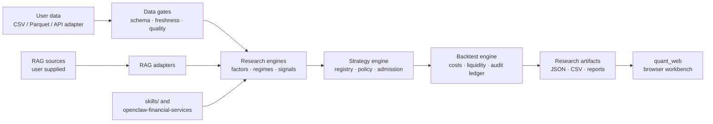

# comprehensive-quant-workbench

> **A declassified, research-first quantitative workbench for reproducible A-share analysis.**
>
> Python research engines · audited backtests · browser workbench · RAG adapters · deployment templates

[🇨🇳 简体中文](README.zh-CN.md) · [English](README.md) · [产品与合规说明](FULL_PUBLIC_RELEASE_README.md)

[](https://github.com/lhnblg2025-stack/comprehensive-quant-workbench/actions/workflows/ci.yml)
[](LICENSE)
[](DECLASSIFICATION_NOTICE_FULL.md)

`comprehensive-quant-workbench` is a modular laboratory for turning market data into inspectable research artifacts. It combines a Python backend, a lightweight browser frontend, a strategy engine, portfolio simulation, factor and regime analysis, operational scripts, reusable skills, and optional retrieval augmented generation (RAG) adapters.

This repository is intentionally a **public research release**. It contains reusable framework code and three reviewed example strategy surfaces. It does not contain credentials, personal workspaces, private research implementations, live account state, runtime databases, or bundled market data.

## What you can do with it

- Build and audit factor or strategy experiments on user-supplied data.
- Run portfolio simulations with explicit costs, lot sizes, liquidity rules, limit-up/limit-down handling, turnover, drawdown, and trade ledgers.
- Explore research results through the browser workbench and JSON/CSV contracts.
- Extend the strategy engine without exposing private strategy recipes.
- Add local or organization-approved RAG sources through documented adapters.
- Deploy the web service locally or use the systemd, timer, Nginx, and container-oriented templates as a starting point.
- Run the same release checks in CI and before publishing a derived fork.

## Architecture



The code is organized around replaceable boundaries:

| Area | Purpose | Entry points |
| --- | --- | --- |
| `quant_system/` | Research, factors, signal generation, portfolio simulation, risk and execution abstractions | `strategy_engine.py`, `strategy_registry.py`, `strategy_matrix_backtest.py` |
| `quant_web/` | Browser UI, HTTP handlers, workbench contracts and dashboards | `python -m quant_web.server` |
| `quant_platform/` | Platform-level audit and integration helpers | package modules and contract tests |
| `scripts/` | Data preparation, report generation, release checks and operations | `scripts/check_release.py` and task-specific scripts |
| `skills/` | Public skill index and reusable workflow notes | `skills/README.md` |
| `openclaw-financial-services/` | Financial-services workflow skills and references | package `README.md` |
| `rag/` | Public retrieval interfaces and source adapters | `RAG_PUBLIC_RELEASE.md` |
| `deploy/` | Environment examples and service templates | `deploy/README.md` |
| `tests/` | Contract, regression, frontend and engine tests | `pytest` |

## The public strategy surface

The release exposes exactly three named strategy families through `quant_system.public_strategies`:

| Key | Signal column | Research meaning |
| --- | --- | --- |
| `rsi_reversal` | `rsi_rev_14` | RSI(14) mean-reversion signal |
| `low_volatility` | `low_vol_60` | 60-session low-volatility signal |
| `momentum_12_1` | `mom_12_1` | 12-to-1-month momentum, skipping the latest month |

The generic engine, portfolio simulator, data contracts, admission gates, and policy layers remain available for extension. Concrete private strategy libraries and their derived research artifacts were removed from the public tree.

```python
from quant_system.public_strategies import (
    PUBLIC_STRATEGY_KEYS,
    list_public_strategies,
    select_signal,
)

print(PUBLIC_STRATEGY_KEYS)
# ('rsi_reversal', 'low_volatility', 'momentum_12_1')

metadata = list_public_strategies()
signal = select_signal("momentum_12_1", frame)
```

## Quick start

The quickest path is a clean virtual environment and the public test suite:

```bash
python3 -m venv .venv
. .venv/bin/activate
python -m pip install -r requirements.txt
python -m pytest -q tests quant_system/tests quant_web/tests scripts/tests -m 'not integration'
```

Start the browser workbench on loopback:

```bash
bash start_quant.sh
# or
python -m quant_web.server
```

Then open the address printed by the server. The frontend is designed to work with empty or user-supplied datasets; no private market snapshot is required to import the code.

Run the release checks locally:

```bash
python3 -m compileall -q quant_system quant_platform quant_web scripts tests
python3 scripts/check_release.py
```

## A small research workflow

1. Prepare a user-owned dataset that satisfies the documented schema and date conventions.
2. Run the data gates before calculating factors or signals.
3. Select one of the three public strategy keys or register a new generic strategy in your own fork.
4. Run the audited simulator with explicit execution assumptions.
5. Save JSON/CSV artifacts outside the repository or in a project-specific output directory.
6. Inspect the trade ledger, costs, drawdown, turnover, and out-of-sample metrics before drawing conclusions.
7. Use the browser workbench to review the resulting artifacts.

Example engine-level usage:

```python
from quant_system.strategy_matrix_backtest import MatrixConfig, simulate_portfolio

config = MatrixConfig(
    top_n=20,
    commission_bps=2.5,
    stamp_duty_bps=5.0,
    slippage_bps=1.0,
)
result = simulate_portfolio(frame, config, frequency="monthly")
print(result["metrics"])
```

The exact input columns and optional controls are documented in the engine modules and their tests. Treat the tests as executable contracts when adapting the workbench to a new data source.

## Browser workbench

The frontend is a static, dependency-light interface backed by the Python server. It includes pages for:

- research and portfolio dashboards;
- strategy templates and the strategy lab;
- backtest consoles and trade-ledger inspection;
- market, intraday, review, and operations views;
- paper-trading and risk-monitoring surfaces;
- an empty public knowledge-base shell for user-provided sources.

The frontend assets live in `quant_web/static/`, while route handlers and response contracts live in `quant_web/handlers/` and `quant_web/`.

## Skills and RAG

The repository includes a public skill index plus financial-services workflow skills for research, earnings analysis, modeling, valuation, sector work, and reporting. Read:

- [skills/README.md](skills/README.md)
- [openclaw-financial-services/README.md](openclaw-financial-services/README.md)
- [RAG_PUBLIC_RELEASE.md](RAG_PUBLIC_RELEASE.md)

RAG is an adapter boundary, not a bundled knowledge export. Point it at sources you are authorized to use, build indexes in a runtime directory, and keep generated embeddings and personal notes out of version control.

## Deployment

`deploy/` contains portable examples for local services, systemd units, timers, Nginx, environment files, and unattended verification. Start with:

- [deploy/README.md](deploy/README.md)
- [deploy/quant.env.example](deploy/quant.env.example)
- [deploy/nginx-quant.conf.example](deploy/nginx-quant.conf.example)

Supply secrets through environment variables or a secret manager. Never commit `.env` files, API keys, certificates, brokerage credentials, or generated runtime data.

## 产品与合规说明

这是一个面向研究团队的工程产品：它把数据门禁、因子研究、策略信号、组合回测、风险诊断、研究报告和浏览器复核串成可追溯流程。产品交付的是可审阅的研究基础设施，不是投资顾问、资产管理、证券经纪或自动交易服务。

使用者必须确认数据、文献、新闻和 RAG 来源具有合法授权，并遵守隐私、信息安全、第三方许可、适当性、模型风险和记录留存要求。不得把客户信息、账户状态、交易凭据、生产日志或私有研究资料提交到公开仓库。真实交易或受监管业务必须经过组织内部的法律、合规、安全和风险审批，并配置权限控制、限额、熔断、审计留痕、人工复核和回滚机制。

回测结果可能受到前视偏差、幸存者偏差、数据修订、滑点、流动性、过拟合和市场制度变化影响。任何结果都不构成投资建议、收益承诺或未来表现预测。完整边界见 [FULL_PUBLIC_RELEASE_README.md](FULL_PUBLIC_RELEASE_README.md)。

## Public-release boundary

The public tree excludes:

- credentials, tokens, private keys, certificates, and `.env` files;
- account, order, position, watchlist, and personal-identifying data;
- databases, caches, logs, generated reports, model binaries, and market-data snapshots;
- recovery, backup, restore, and machine-specific directories;
- concrete private strategy implementations and their private research outputs.

The declassification process and review assumptions are documented in:

- [DECLASSIFICATION_NOTICE_FULL.md](DECLASSIFICATION_NOTICE_FULL.md)
- [docs/RELEASE_SCOPE.md](docs/RELEASE_SCOPE.md)
- [FULL_PUBLIC_RELEASE_README.md](FULL_PUBLIC_RELEASE_README.md)

The release scanner checks tracked files for common secrets, personal paths, runtime artifacts, nested Git repositories, recovery directories, and oversized binary payloads. It is a guardrail, not a substitute for human review.

## Validation

The release was validated with:

```text
1663 passed, 11 skipped, 2 deselected
compileall: passed
scripts/check_release.py: 1169 files scanned, 0 findings
```

Use the same commands after changing public files. Integration tests that require external services or user-owned datasets are intentionally excluded from the default clean-clone run.

## License and responsible use

Review the repository and dependency licenses before redistributing a derived product. Research outputs are informational only; they are not investment advice, a guarantee of returns, or a substitute for human review, legal review, or operational controls.
